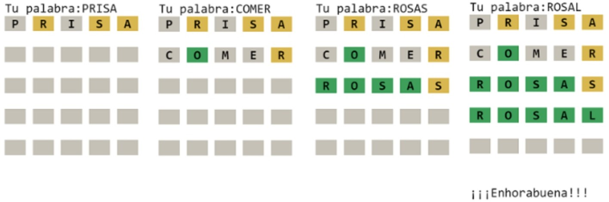

# Práctica 10. Ficheros - Wordlet PRO

## Objetivo
Esta práctica pretende alcanzar los siguientes resultados de aprendizaje:
- Dominar el proceso de lectura y escritura de ficheros de texto.
- Ejecutar programas por consola con envío de parámetros al programa principal.
- Modularización y tipificación de variables. Muy importante. El programa deberá tener un buen diseño.
- Profundizar en el tratamiento de matrices.

## Enunciado

Se deberá partir de la "Práctica 5. Wordlet" y mejorar la funcionalidad para que cumpla con los siguientes requisitos técnicos y funcionales:
- El programa deberá tener dos módulos (ficheros.py) ejecutables, con main:
    + **crear_fichero_5letras.py**: primero se ejecutará este programa para tomar de un diccionario de palabras, aquellas que sean válidas para el juego. Para ello, se leerá el fichero de palabras suministrado "palabras.txt", se deberá limpiar y generar un nuevo fichero llamado "palabras_worldlet.txt" el cual tendrá los siguientes requisitos de data-cleaning. Antes de poder empezar a jugar, deberemos ejecutar este programa para tener el fichero de palabras del juego.
        - Tomar solo las palabras de 5 letras.
        - Convertir los caracteres con acentos a caracteres sin ellos. Por ejemplo "acabé" se transformará en "acabe".
    + **worldlet.py**: será el programa que ejecute el juego en sí. Lo primero que debe hacer el programa será validar que existe el fichero de palabras válidas "palabras_worldlet.txt". Si no fuese así, porque no se ha ejecutado el programa anterior de transformación de palabras, se mostrará el mensaje "Fichero de palabras no encontrado, se utilizará una palabra fija". Esa palabra fija será "ROSAL". Además, si el programa recibe el argumento 1 por consola, el juego mostrará la palabra a adivinar para facilitar la tareas de testing. Si no recibe nada o cualquier otro valor se ejecutará normalmente.
        - "python worldlet.py 1"
- Adaptar el juego para que en lugar de trabajar con la estructura de cadenas de caracteres que teníamos, trabaje con una matriz de 5 x 5.
- Deberá rediseñarse para que el programa esté modularizado en funciones (tipificadas).

## Ayuda

- Comprobar la codificación de un fichero de texto:

Si al abrir un fichero obtenemos este error es porque a codificación por defecto el ordenador es incompatible con la del fichero. Ver la mini-práctica.

```
UnicodeDecodeError: 'charmap' codec can't decode byte 0x81 in position 3030: character maps to <undefined>
```

Por ese motivo, deberemos utilizar la codificación exacta del fichero:

```python
with open("a.txt", "r", encoding = "utf-8") as fichero:
```

- Pasar argumentos a un programa Python:

En consola: 
```python
python wordlet.py 1
```

En Python:
```python
import sys

argumentos = sys.argv
print(argumentos)

SALIDA:
['wordlet.py', '1']
```

- Saber si un fichero existe:
```
import os.path

existe_fichero = os.path.isfile("palabras_wordle.txt")
print(existe_fichero)

```
- Crear un fichero que guarde el histograma de resultados, como en el juego real. El objetivo es mostrar las veces que se ha resuelto el tablero a la primera palabra introducida, a la segunda, etc. o no se ha llegado a adivinar. Se sugiere pensar en un objeto/variable Python que pueda almacenar esta información de la forma más encilla posible y guardarlo en un fichero binario mediante pickle (ver apuntes). La salida, puede ser similar a la siguiente:
```
Estadísticas
------------
1 #
2 #
3 ##
4 ####
5 #####
X ###
```

## Requisito opcional
- Mejorar la lógica del juego para que identifique correctamente las letras que existen pero no están bien colocadas. [Difícil] 

### Salida del juego

