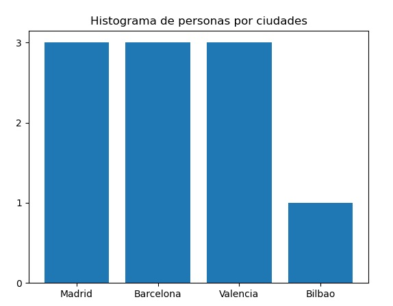

# Práctica 10. Excepciones

## Objetivo
Esta práctica pretende alcanzar los siguientes resultados de aprendizaje:
- Saber modularizar un programa en varios módulos y funciones.
- Dominar la gestión de excepciones.
- Programar mediante un estilo limpio y ordenado.
- Saber elegir la estructura de datos que mejor se adapta a cada problema.

## Enunciado

### Funcionalidad

Se desea desarrollar un programa que almacene información de personas: nombre, dni y ciudad. El objeto final de este programa es agrupar las personas por ciudades, como se puede ver en las opciones que se ofrecen: mostrar las personas de una ciudad en concreto o dibujar el histograma de personas por ciudades (número de personas que viven en la misma ciudad, ver salida del programa).

Para no tener que crear las personas en cada ejecución, se habilitará la opción 2 para cargar un conjunto de personas por defecto.

### Operaciones a realizar

El programa deberá presentar el siguiente menú:

```
1.- Crear persona
2.- Cargar personas por defecto
3.- Mostrar todas las personas
4.- Mostrar personas de una ciudad
5.- Dibujar histograma por ciudades
6.- Salir
```

### Estructura del programa
Desarrollar un programa que esté organizado en varios módulos (ficheros.py):
- main.py: programa principal con la función main.
- operaciones.py: funcionalidad de las distintas opciones a ejecutar en el programa.
- excepciones.py: definición de las excepciones que contendrá el programa.

La estructura del programa principal será la que se muestra, dándonos una idea de las excepciones que tenemos que crear. 
```python
if __name__ == "__main__":
    opcion = 0
    while opcion != 6:
        opcion_valida = False
        while not opcion_valida:
            try:
                opcion = mostrar_menu()
                opcion_valida = True
            except OpcionNoValidaError as error:
                print(error)
        
        if opcion == 1:
            try:
                crear_personas()
            except NombreError as error:
                print("··E001··", error)
            except DNIError as error:
                print("··E002··", error)
        elif opcion == 2:
            cargar_personas_por_defecto()
        elif opcion == 3:
            mostrar_todas_personas()
        elif opcion == 4:
            mostrar_personas_ciudad()
        elif opcion == 5:
            dibujar_histograma()

```

### Restricciones
- Cuando el usuario introduzca una opción no válida, se lanzará una excepción del tipo OpcionNoValidaError, mostrando uno de estos dos mensajes:
	+ "La opción debe estar entre 1 y 6"  --> si se introduce un número fuera del rango de opciones.
	+ "Introduce un número" --> si se introduce un opción no númerica.
- El nombre deberá estár en el formato: Aaaaaa (primera letra mayúsculas y el resto en minúsculas). Si no es así se lanzará la excepción: **NombreError**
- El DNI tendrá dos números y una letra. La letra será el carácter equivalente al valor ASCII 65 + la suma de los dos dígitos anteriores. Por ejemplo, en el caso de 11, la letra será 65 + 1 + 1 = 67, valor ASCII de la letra C. Si no se corresponde con ese formato y valores se lanzará la excepción **DNIError**.

### Salida generada

Imagen que muestra la salida de la opción 5 y 3.

